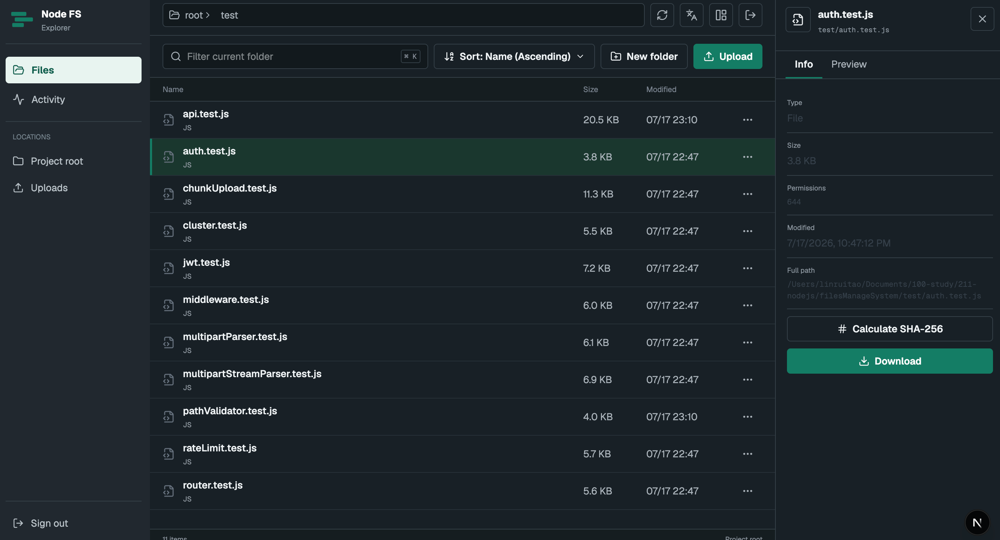
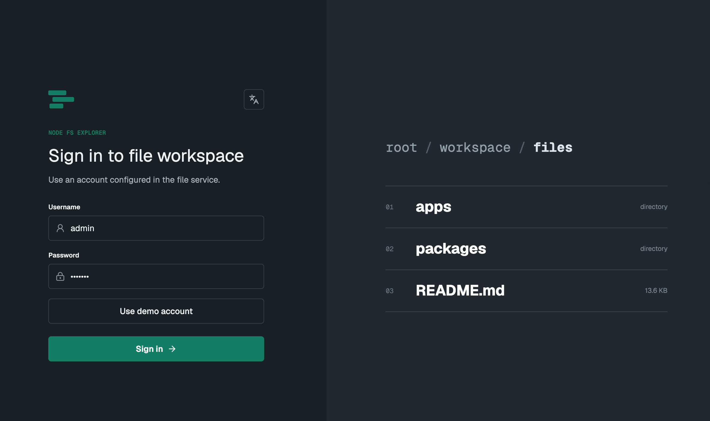
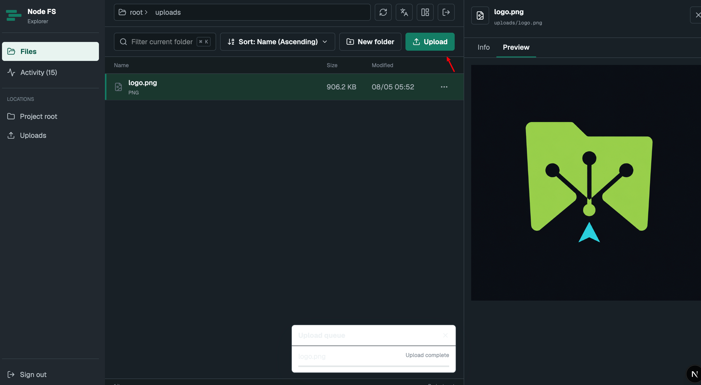
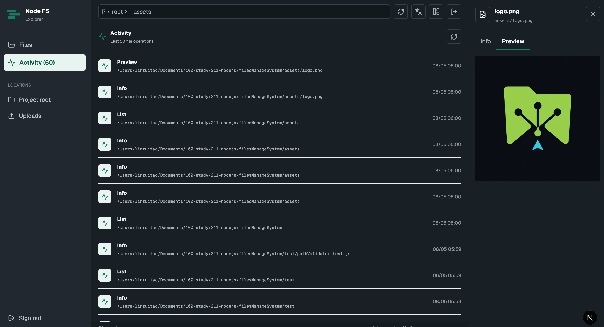

<p align="center">
  
</p>

<h1 align="center">node-fs-explorer</h1>

<p align="center">
  <strong>A production-ready, zero-dependency file management system built from scratch with Node.js.</strong><br />
  <em>Monorepo · Web Console + REST API + CLI · 143 tests · CI/CD · JWT Auth · Streaming Upload</em>
</p>

<p align="center">
  <a href="https://github.com/bruce4code/node-fs-explorer/actions/workflows/ci.yml"></a>
  
  
  
  
  
  
  
</p>

---

English | [中文](#概述)

---

## 📸 Screenshots

<p align="center">
  
</p>

<p align="center">
  
  
  
</p>

*Home page (file manager) · Login (BFF session) · Upload showcase · Activity log*

---

## 📖 Overview

**node-fs-explorer** is a complete file management system built **from scratch using only Node.js native modules** (`fs`, `http`, `path`, `stream`, `crypto`, `events`, `cluster`) — **zero backend dependencies**. It demonstrates deep Node.js engineering: hand-written JWT, streaming multipart parser, chunked resumable uploads, cluster multi-process, rate limiting, and a BFF (Backend-for-Frontend) web console.

> Two audiences in one: an **interview-ready Node.js deep-dive** for engineers, and a **functional, deployable product** for end users.

---

## 🏗️ Architecture — pnpm Monorepo

The project is structured as a **pnpm workspace monorepo** with clear separation of apps and reusable packages:

```
node-fs-explorer/
├── apps/
│   ├── web/                # Next.js 16 console + BFF proxy (HttpOnly JWT cookie)
│   ├── server/             # Zero-dependency Node.js HTTP API + cluster mode
│   └── cli/                # CLI commands (list/read/info/mkdir/...)
├── packages/
│   ├── core/               # Shared file-system business logic (fileService, chunkUpload)
│   ├── node-utils/         # JWT, multipart parsers, logger — zero-dependency libs
│   └── contracts/          # TypeScript API contracts shared by web & server
└── test/                   # 143 tests (node:test)
```

**Why monorepo?**

- **Shared contracts** — `packages/contracts` types are consumed by both the Next.js app and the API, keeping request/response shapes in sync with zero drift.
- **Atomic changes** — a feature spanning frontend + backend ships in a single commit/PR.
- **Single workflow** — one `pnpm install`, one test command, one CI pipeline.
- **Reusable packages** — `core` and `node-utils` are publishable and testable in isolation.

---

## 💻 Tech Stack

| Layer | Technology | Notes |
|---|---|---|
| Backend | **Node.js native modules only** | `http`, `stream`, `crypto`, `cluster`, `events` — zero npm deps |
| Web console | **Next.js 16 + React 19 + TypeScript** | App Router, Server Components, BFF API routes |
| UI | Radix UI + Tailwind CSS 4 | Accessible primitives, dark console styling |
| Auth | Hand-written **JWT (HS256)** | `crypto.timingSafeEqual`, blacklist, refresh tokens |
| Upload | **Streaming multipart + chunked upload** | Resumable, idempotent, MD5 instant upload |
| Testing | **`node:test` (backend) + Vitest (frontend)** | 143 backend tests, no test framework on backend |
| Tooling | pnpm workspaces · GitHub Actions · Turbopack | CI on Node 18/20/22 |
| Deploy | Ready for **Vercel (web) + VPS (API)** | BFF proxies cross-origin auth for you |

---

## ✨ Features

```
┌──────────────────────────────────────────────────┐
│               node-fs-explorer                    │
├──────────────────────────────────────────────────┤
│  CLI  ────  list / read / info / mkdir / write   │
│            copy / remove / search / hash          │
├──────────────────────────────────────────────────┤
│  API  ─────  GET    /api/files                   │
│              GET    /api/files/info               │
│              GET    /api/files/download            │
│              GET    /api/files/search              │
│              GET    /api/files/preview             │
│              GET    /api/files/hash                │
│              GET    /api/files/logs                │
│              POST   /api/files/upload              │
│              POST   /api/files/mkdir               │
│              POST   /api/files/upload/init         │
│              POST   /api/files/upload/chunk        │
│              POST   /api/files/upload/complete     │
│              PUT    /api/files/move                │
│              DELETE /api/files                     │
├──────────────────────────────────────────────────┤
│  Auth  ────  JWT (HS256) / API Token / Login     │
│  Rate  ────  Sliding window per IP               │
│  Cluster ──  Multi-process with auto restart     │
└──────────────────────────────────────────────────┘
```

### Key Highlights

- **Zero backend dependencies** — HTTP server, router, body parser, JWT, multipart parser: all hand-written
- **pnpm monorepo** — `apps/` + `packages/` with shared TypeScript contracts
- **JWT from scratch** — HMAC-SHA256, expiration, blacklist, refresh (`packages/node-utils/jwt.js`)
- **Streaming multipart parser** — state-machine `Transform` stream, no full-buffer memory blowup
- **Chunked upload** — resumable, idempotent, MD5 instant upload, streaming merge
- **Web console (Next.js 16)** — BFF proxy keeps JWT in HttpOnly cookie, protects against XSS
- **143 backend tests** — native `node:test`, CI on Node 18/20/22
- **Security by design** — path traversal guard, timing-safe compare, rate limiting, body/file size limits

---

## 🚀 Quick Start

```bash
# Clone
git clone https://github.com/bruce4code/node-fs-explorer.git
cd node-fs-explorer

# Install workspace dependencies
pnpm install

# Run backend tests
pnpm test:backend

# CLI mode
pnpm cli -- list
pnpm cli -- read package.json
pnpm cli -- search . "*.js"
pnpm cli -- hash package.json sha256

# API mode (single process) on :3300
JWT_SECRET=my-secret JWT_USERS='{"admin":"pass123"}' pnpm dev:server

# Web console on :3000 (Next.js, auto-proxies API to :3300)
JWT_SECRET=my-secret JWT_USERS='{"admin":"pass123"}' pnpm dev

# API mode (multi-process cluster)
JWT_SECRET=my-secret JWT_USERS='{"admin":"pass123"}' pnpm start
```

Open http://localhost:3000 and sign in with `admin` / `pass123` (demo). The Next.js app keeps the JWT in an HttpOnly cookie and forwards requests to `FILE_API_URL` (defaults to `http://127.0.0.1:3300`).

---

## 🧪 Testing

```bash
pnpm test:backend     # Full backend suite (143 tests)
pnpm test:unit        # Unit tests only
pnpm test:api         # API integration tests
pnpm test             # Backend + frontend (Vitest) suites
```

All backend tests use Node.js native [`node:test`](https://nodejs.org/api/test.html) — **no test framework required on the backend**. Frontend uses Vitest.

---

## 🗺️ Knowledge Map

Each phase maps to concrete Node.js topics and interview questions:

### Phase 1 — CLI File Operations

| Topic | What you'll learn | Interview relevance |
|---|---|---|
| `require` / CommonJS | Module system, caching, circular deps | ⭐⭐⭐⭐⭐ |
| `fs` module | promises API vs sync vs callback | ⭐⭐⭐⭐⭐ |
| `path` module | resolve/join/basename, cross-platform | ⭐⭐⭐⭐ |
| `process.argv` | CLI argument parsing | ⭐⭐⭐ |

### Phase 2 — Web API

| Topic | What you'll learn | Interview relevance |
|---|---|---|
| `http.createServer` | req/res as streams | ⭐⭐⭐⭐⭐ |
| URL routing | `new URL()`, pathname, searchParams | ⭐⭐⭐⭐ |
| Body parsing | JSON, urlencoded, multipart boundary | ⭐⭐⭐⭐⭐ |
| CORS | Preflight, OPTIONS, headers | ⭐⭐⭐⭐ |
| Graceful shutdown | SIGINT/SIGTERM, server.close() | ⭐⭐⭐⭐ |

### Phase 3 — Advanced Features

| Topic | What you'll learn | Interview relevance |
|---|---|---|
| `stream.pipeline` | vs pipe, resource cleanup, error handling | ⭐⭐⭐⭐⭐ |
| Backpressure | pause/drain/resume cycle | ⭐⭐⭐⭐⭐ |
| `events.EventEmitter` | Pub-sub pattern, memory leak | ⭐⭐⭐⭐⭐ |
| `crypto.createHash` | Streaming hash, MD5 vs SHA256 | ⭐⭐⭐⭐ |
| Recursive traversal | BFS/DFS, depth limits, permission handling | ⭐⭐⭐⭐ |

### Phase 4 — Security & Performance

| Topic | What you'll learn | Interview relevance |
|---|---|---|
| Rate limiting | Sliding window, X-Forwarded-For, Redis | ⭐⭐⭐⭐⭐ |
| `cluster` module | Multi-process, SO_REUSEADDR, IPC | ⭐⭐⭐⭐⭐ |
| Auto-restart | Crash recovery, circuit breaker | ⭐⭐⭐⭐ |
| Timing-safe compare | `crypto.timingSafeEqual` | ⭐⭐⭐⭐ |

### Phase 5 — Large File Upload

| Topic | What you'll learn | Interview relevance |
|---|---|---|
| Chunked upload | init/upload/complete/abort protocol | ⭐⭐⭐⭐⭐ |
| Resumable upload | Idempotent chunks, status query | ⭐⭐⭐⭐⭐ |
| MD5 instant upload | Sidecar file, deduplication | ⭐⭐⭐⭐⭐ |
| Streaming multipart | Transform stream, state machine | ⭐⭐⭐⭐⭐ |
| Streaming merge | `pipe({ end: false })`, sequential read | ⭐⭐⭐⭐ |

---

## 🛡️ Security

| Feature | Implementation |
|---|---|
| Path traversal | `path.resolve()` + `startsWith()` guard |
| Timing attack | `crypto.timingSafeEqual` for all comparisons |
| Rate limiting | Per-IP sliding window with cleanup |
| JWT auth | HMAC-SHA256, expiration, blacklist, refresh |
| BFF cookie | JWT stored in HttpOnly cookie, never exposed to JS |
| Body size limit | 50MB max request body |
| Token revocation | In-memory blacklist with auto-cleanup |
| File size check | 500MB download limit, 1GB upload limit |

---

## 📄 License

MIT

---

<br>

<h1 align="center">node-fs-explorer</h1>

<p align="center">
  <strong>从零手写的生产级文件管理系统 —— 零依赖 Node.js 后端 + Next.js 前端，Monorepo 架构。</strong><br />
  <em>Web 控制台 · REST API · CLI · 143 个测试 · CI/CD · JWT 鉴权 · 流式上传</em>
</p>

---

## 概述

**node-fs-explorer** 是一个**从零手写、零后端依赖**的完整文件管理系统，覆盖 CLI、REST API、Web 控制台三层形态。后端全部使用 Node.js 原生模块（`fs`、`http`、`path`、`stream`、`crypto`、`events`、`cluster`）实现 —— **手写 JWT、流式 multipart 解析器、分片断点续传、Cluster 多进程、滑动窗口限流**，并配有基于 Next.js 的 BFF（Backend-for-Frontend）Web 控制台。

> 一份代码两个受众：对工程师它是**面试级 Node.js 深度实战**，对使用者它是**可部署的产品级应用**。

---

## 🏗️ 架构 —— pnpm Monorepo

项目采用 **pnpm workspace monorepo** 结构，应用与可复用包清晰分层：

```
node-fs-explorer/
├── apps/
│   ├── web/                # Next.js 16 控制台 + BFF 代理（HttpOnly JWT Cookie）
│   ├── server/             # 零依赖 Node.js HTTP API + Cluster 多进程
│   └── cli/                # CLI 命令（list/read/info/mkdir/...）
├── packages/
│   ├── core/               # 共享文件业务逻辑（fileService、chunkUpload）
│   ├── node-utils/         # JWT、multipart 解析器、logger —— 零依赖工具库
│   └── contracts/          # 前后端共享的 TypeScript API 类型
└── test/                   # 143 个测试（node:test）
```

**为什么用 Monorepo？**

- **类型共享** — `packages/contracts` 同时被 Next.js 前端和 API 后端引用，接口字段零漂移
- **原子提交** — 前后端联动的功能一个 PR 完成
- **单一工作流** — 一次 `pnpm install`、一条测试命令、一条 CI 流水线
- **包可复用** — `core` 与 `node-utils` 独立可测试、可发布

---

## 💻 技术栈

| 分层 | 技术 | 说明 |
|---|---|---|
| 后端 | **纯 Node.js 原生模块** | `http`、`stream`、`crypto`、`cluster`、`events` —— 零 npm 依赖 |
| Web 控制台 | **Next.js 16 + React 19 + TypeScript** | App Router、Server Components、BFF API 路由 |
| UI | Radix UI + Tailwind CSS 4 | 无障碍基础组件、深色控制台风格 |
| 鉴权 | 手写 **JWT（HS256）** | `crypto.timingSafeEqual`、黑名单、刷新令牌 |
| 上传 | **流式 multipart + 分片上传** | 断点续传、幂等、MD5 秒传 |
| 测试 | 后端 **`node:test`** + 前端 Vitest | 143 个后端测试，后端零测试框架 |
| 工具链 | pnpm workspaces · GitHub Actions · Turbopack | Node 18/20/22 三版本 CI |
| 部署 | 适配 **Vercel（前端）+ VPS（API）** | BFF 代理自动处理跨域与鉴权 |

---

## ✨ 功能亮点

- **零后端依赖** — HTTP 服务器、路由、body 解析、JWT、multipart 解析全部手写
- **pnpm monorepo** — `apps/` + `packages/`，共享 TypeScript 契约
- **手写 JWT** — HMAC-SHA256、过期、黑名单、刷新（`packages/node-utils/jwt.js`）
- **流式 multipart 解析器** — 状态机 `Transform` Stream，大文件不占满内存
- **分片上传** — 断点续传、幂等性、MD5 秒传、流式合并
- **Web 控制台（Next.js 16）** — BFF 代理将 JWT 存于 HttpOnly Cookie，防 XSS 窃取
- **143 个后端测试** — 原生 `node:test`，Node 18/20/22 CI
- **安全设计** — 路径穿越防护、恒定时间比较、限流、请求体/文件大小限制

---

## 🚀 快速开始

```bash
# 克隆
git clone https://github.com/bruce4code/node-fs-explorer.git
cd node-fs-explorer

# 安装 workspace 依赖
pnpm install

# 运行后端测试
pnpm test:backend

# CLI 模式
pnpm cli -- list
pnpm cli -- read package.json
pnpm cli -- search . "*.js"
pnpm cli -- hash package.json sha256

# API 模式（单进程，:3300）
JWT_SECRET=my-secret JWT_USERS='{"admin":"pass123"}' pnpm dev:server

# Web 控制台（:3000，Next.js 自动代理 API 到 :3300）
JWT_SECRET=my-secret JWT_USERS='{"admin":"pass123"}' pnpm dev

# API 模式（多进程 Cluster）
JWT_SECRET=my-secret JWT_USERS='{"admin":"pass123"}' pnpm start
```

打开 http://localhost:3000 ，使用演示账号 `admin` / `pass123` 登录。Next.js 应用将 JWT 保存在 HttpOnly Cookie 中，并通过 `FILE_API_URL`（默认 `http://127.0.0.1:3300`）转发请求。

---

## 🧪 测试

```bash
pnpm test:backend     # 后端全量测试（143 个）
pnpm test:unit        # 纯单元测试
pnpm test:api         # API 集成测试
pnpm test             # 后端 + 前端（Vitest）全套
```

后端测试全部使用 Node.js 原生 [`node:test`](https://nodejs.org/api/test.html) —— **后端零测试框架**。前端使用 Vitest。

---

## 🗺️ 知识点覆盖

| 模块 | 知识点 | 面试价值 |
|---|---|---|
| `fs` | promises/sync/callback 三种 API | ⭐⭐⭐⭐⭐ |
| `http` | 原生 HTTP 服务器，req/res 即 Stream | ⭐⭐⭐⭐⭐ |
| `stream` | pipeline/pipe、背压、Transform | ⭐⭐⭐⭐⭐ |
| `events` | EventEmitter、发布-订阅、内存泄漏 | ⭐⭐⭐⭐⭐ |
| `crypto` | 哈希、HMAC、恒定时间比较 | ⭐⭐⭐⭐⭐ |
| `cluster` | 多进程、负载均衡、进程管理 | ⭐⭐⭐⭐⭐ |
| `path` | 路径解析、穿越防护、跨平台 | ⭐⭐⭐⭐ |
| `buffer` | 二进制数据操作 | ⭐⭐⭐⭐ |
| `process` | argv/env/exit/信号处理 | ⭐⭐⭐⭐ |

---

## 🛡️ 安全措施

| 措施 | 实现方式 |
|---|---|
| 路径穿越防护 | `path.resolve()` + `startsWith()` 校验 |
| 计时攻击防护 | `crypto.timingSafeEqual` 恒定时间比较 |
| 限流 | 基于 IP 的滑动窗口（默认 100 次/分钟） |
| JWT 鉴权 | HMAC-SHA256、过期、黑名单、刷新 |
| BFF Cookie | JWT 存于 HttpOnly Cookie，JS 无法读取 |
| 请求体限制 | 最大 50MB |
| Token 撤销 | 内存黑名单 + 自动清理 |
| 文件大小限制 | 下载 500MB、上传 1GB 上限 |

---

## 📄 许可证

MIT
