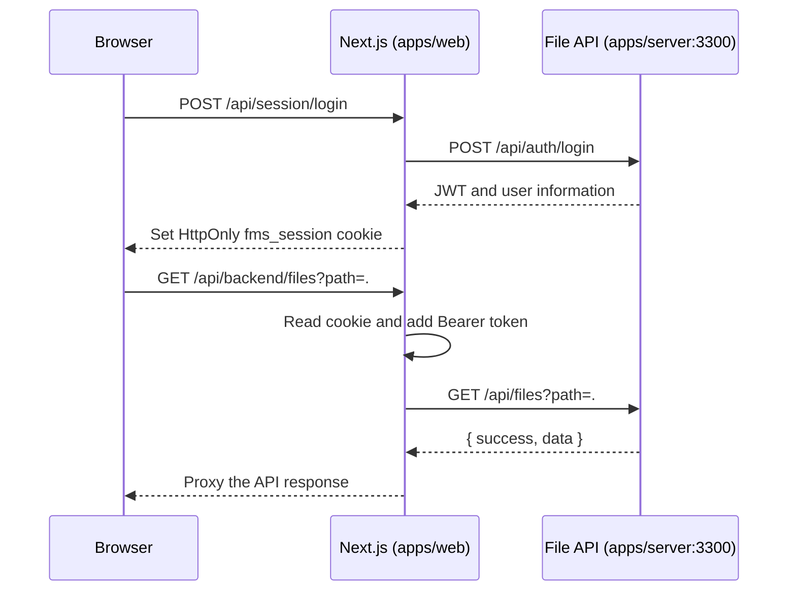

# Frontend Architecture and Usage Guide

This guide introduces the file-management frontend: its layout, request flow, daily use, and the main places to make changes.

For the Chinese version, see [FRONTEND.zh-CN.md](./FRONTEND.zh-CN.md).

## Stack

The frontend lives in `apps/web` and uses Next.js 16 with the App Router.

| Responsibility | Implementation |
| --- | --- |
| Pages and routing | Next.js App Router |
| Interactive UI | React 19 client components |
| Shared API types | `@file-manager/contracts` workspace package |
| UI primitives | Radix UI |
| Icons | Lucide React |
| Styling | Global CSS with a Tailwind PostCSS entry point |
| Authentication | HttpOnly session cookie backed by a JWT |

There is no global state library such as Redux or Zustand. File entries, selection, dialogs, upload progress, and the activity-log view are local state in `FileManager`.

## Project Layout

```text
apps/web/
├── src/app/
│   ├── page.tsx                         # Workspace entry; renders FileManager
│   ├── login/page.tsx                   # Login page
│   ├── layout.tsx                       # Root layout, fonts, and metadata
│   ├── globals.css                      # Global and responsive styles
│   └── api/
│       ├── backend/[...path]/route.ts   # Protected upstream API proxy
│       └── session/                     # Login, logout, and session endpoints
├── src/components/
│   ├── file-manager.tsx                 # Main file workspace
│   └── login-form.tsx                   # Login form
├── src/lib/
│   ├── client-api.ts                    # Browser request and display helpers
│   └── server-api.ts                    # Cookie and upstream URL helpers
└── src/proxy.ts                         # Page-level authentication redirects
```

## Authentication and Request Flow

The browser talks only to the Next.js application. The JWT is never exposed to browser JavaScript: Next.js stores it in the `fms_session` HttpOnly cookie and forwards it to the file API.



Key files:

- `src/proxy.ts`: redirects unauthenticated users from `/` to `/login`, and authenticated users from `/login` to `/`.
- `src/app/api/session/login/route.ts`: logs in through the backend and writes the HttpOnly cookie.
- `src/app/api/backend/[...path]/route.ts`: proxies file API calls and automatically attaches `Authorization: Bearer <token>`.
- `src/lib/client-api.ts`: `api<T>()` is the standard browser-side request helper. It calls `/api/backend/*` and redirects to login on a `401`.

The upstream API defaults to `http://127.0.0.1:3300`. Set `FILE_API_URL` when it is hosted elsewhere.

## Workspace Implementation

`src/components/file-manager.tsx` contains the primary interaction logic.

| State | Purpose |
| --- | --- |
| `path`, `entries` | Current directory and its entries |
| `workspaceView` | `files` or `logs` workspace view |
| `selected`, `info` | Selected entry and its metadata |
| `preview`, `hash` | File preview and SHA-256 result |
| `modal` | Create-directory, rename, and delete dialogs |
| `uploads` | Upload queue and progress |
| `loading`, `error`, `toast` | Loading, error, and feedback states |

| UI action | File API endpoint |
| --- | --- |
| List a directory | `GET /files?path=` |
| Entry details | `GET /files/info?path=` |
| Preview a file | `GET /files/preview?path=` |
| Compute a hash | `GET /files/hash?path=&algorithm=sha256` |
| Create a directory | `POST /files/mkdir` |
| Rename | `PUT /files/move` |
| Delete | `DELETE /files?path=` |
| Small-file upload | `POST /files/upload` |
| Large-file upload | `/files/upload/init`, `/chunk`, `/complete` |
| Activity logs | `GET /files/logs?max=50` |

The workspace supports selecting files for details, opening directories with a double click, renaming and deleting from the row menu, drag-and-drop upload, file-picker upload, filtering, and sorting. Activity logs exist only in the backend process memory and are reset when that process restarts.

## Local Development and Usage

Install workspace dependencies once:

```bash
pnpm install
```

Run the frontend and backend separately. This avoids the local `node --watch` file-watch limit that can stop the backend development command on this machine.

```bash
# Terminal 1: frontend at http://localhost:3000
pnpm dev:web

# Terminal 2: backend at http://localhost:3300
JWT_SECRET=my-secret JWT_USERS='{"admin":"pass123"}' pnpm start:single
```

Open `http://localhost:3000` and sign in with `admin` / `pass123`.

When the system has sufficient file-watch capacity, both applications can be started together:

```bash
JWT_SECRET=my-secret JWT_USERS='{"admin":"pass123"}' pnpm dev
```

Useful checks:

```bash
pnpm --filter @file-manager/web exec tsc --noEmit
pnpm --filter @file-manager/web build
pnpm --filter @file-manager/web lint
```

## Where to Make Changes

- **Add workspace behavior:** start in `src/components/file-manager.tsx`. Reuse `api<T>()`; do not call port `3300` directly from a component.
- **Add a backend endpoint:** implement it under `apps/server`. The catch-all frontend proxy already forwards paths and the supported HTTP methods.
- **Add a page:** create `src/app/<route>/page.tsx`, then update `src/proxy.ts` if its access rule differs from the existing pages.
- **Add styles:** update `src/app/globals.css`, reuse variables such as `--signal`, `--line`, and `--panel`, and check the mobile media query.
- **Add shared response types:** add them to `packages/contracts/index.ts` and consume the type from both applications.

## Current Boundaries

- The workspace is currently one large client component. As it grows, extract the file list, details panel, upload queue, and activity-log view into focused components, then move API calls into hooks or a service layer.
- `FILE_API_URL` is server-side configuration. Do not expose it as `NEXT_PUBLIC_*`: authenticated requests are intended to pass through the local proxy.
- The login cookie is HttpOnly, so browser JavaScript cannot read the token. This is intentional; authenticated browser requests should use `/api/backend/*`.
