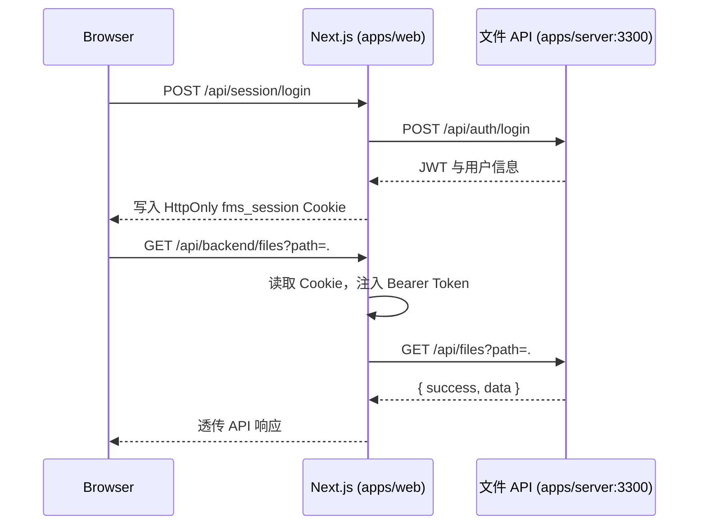

# 前端架构与使用指南

本文面向首次接触此项目的开发者，说明文件管理前端的组织方式、请求链路和日常使用方法。

英文主版本见 [FRONTEND.md](./FRONTEND.md)。

## 技术栈

前端位于 `apps/web`，使用 Next.js 16 App Router。

| 职责 | 实现 |
| --- | --- |
| 页面与路由 | Next.js App Router |
| 交互界面 | React 19 客户端组件 |
| 类型契约 | `@file-manager/contracts` workspace 包 |
| UI 基础组件 | Radix UI |
| 图标 | Lucide React |
| 样式 | 全局 CSS + Tailwind 的 PostCSS 入口 |
| 身份认证 | HttpOnly 会话 Cookie + 后端 JWT |

没有引入 Redux、Zustand 等全局状态库。文件列表、选中项、弹窗、上传进度和日志视图等界面状态都集中在 `FileManager` 组件中管理。

## 文件结构

```text
apps/web/
├── src/app/
│   ├── page.tsx                         # 工作台入口，渲染 FileManager
│   ├── login/page.tsx                   # 登录页
│   ├── layout.tsx                       # 根布局、字体与元数据
│   ├── globals.css                      # 全局与响应式样式
│   └── api/
│       ├── backend/[...path]/route.ts   # 受保护的后端 API 转发层
│       └── session/                     # 登录、登出、会话验证
├── src/components/
│   ├── file-manager.tsx                 # 文件工作台主体
│   └── login-form.tsx                   # 登录表单
├── src/lib/
│   ├── client-api.ts                    # 客户端请求工具与显示格式化
│   └── server-api.ts                    # Cookie、后端地址工具
└── src/proxy.ts                         # 页面级登录访问控制
```

## 页面与认证链路

浏览器只访问 Next.js 前端。JWT 不返回给客户端 JavaScript，而是作为 `fms_session` HttpOnly Cookie 由 Next.js 持有和转发。



- `src/proxy.ts`：未登录访问 `/` 跳转 `/login`；已登录访问 `/login` 回到 `/`。
- `src/app/api/session/login/route.ts`：向后端登录并写入 HttpOnly Cookie。
- `src/app/api/backend/[...path]/route.ts`：统一代理文件 API，自动附带 Bearer Token。
- `src/lib/client-api.ts`：界面组件通过 `api<T>()` 请求 `/api/backend/*`，收到 401 时回到登录页。

后端默认地址是 `http://127.0.0.1:3300`，可通过 `FILE_API_URL` 覆盖。

## 工作台实现与使用

`src/components/file-manager.tsx` 是主交互组件，维护目录、文件项、选中项、详情、预览、哈希、上传、弹窗、操作日志和加载反馈等状态。

文件工作区支持单击查看详情、双击文件夹进入目录、行尾菜单重命名或删除、拖放上传、文件选择上传、按名称筛选与排序。操作记录存放在后端当前进程内存中，重启后端后会清空。

## 本地启动

```bash
pnpm install

# 终端 1：前端，http://localhost:3000
pnpm dev:web

# 终端 2：后端，http://localhost:3300
JWT_SECRET=my-secret JWT_USERS='{"admin":"pass123"}' pnpm start:single
```

访问 `http://localhost:3000`，使用 `admin` / `pass123` 登录。

本机文件监听额度足够时，也可以同时启动：

```bash
JWT_SECRET=my-secret JWT_USERS='{"admin":"pass123"}' pnpm dev
```

## 修改入口

- 新增工作台功能：从 `src/components/file-manager.tsx` 开始，并复用 `api<T>()`，不要从浏览器直接请求 `:3300`。
- 新增后端接口：先在 `apps/server` 实现 `/api/*` 路由，前端 `[...path]` 代理会转发路径和已支持的方法。
- 新增页面：创建 `src/app/<route>/page.tsx`；必要时更新 `src/proxy.ts` 的访问规则。
- 新增样式：更新 `src/app/globals.css`，沿用 `--signal`、`--line`、`--panel` 等变量并检查移动端规则。
- 新增共享类型：在 `packages/contracts/index.ts` 中定义，由前后端共同引用。
